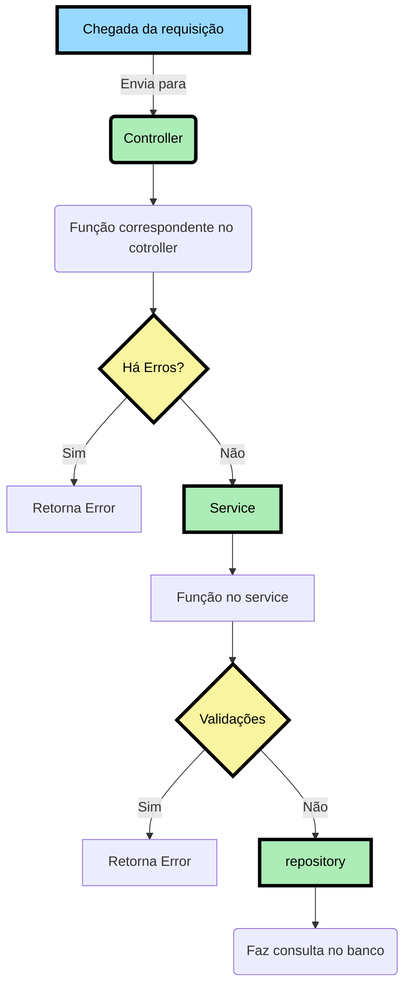
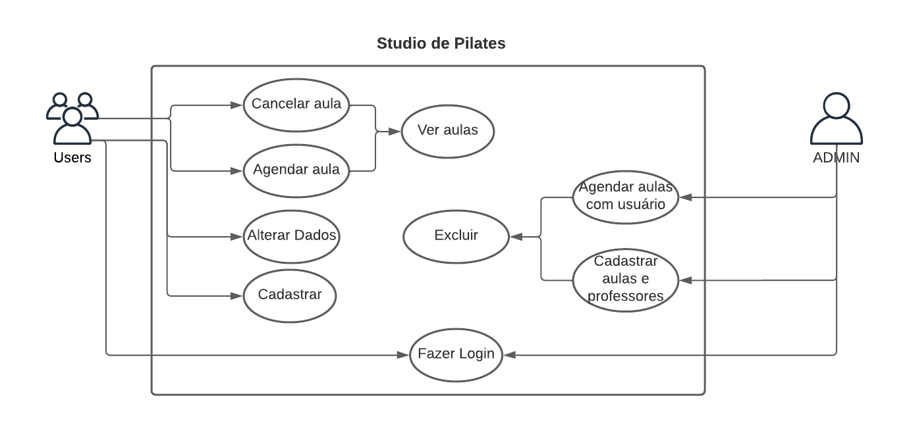
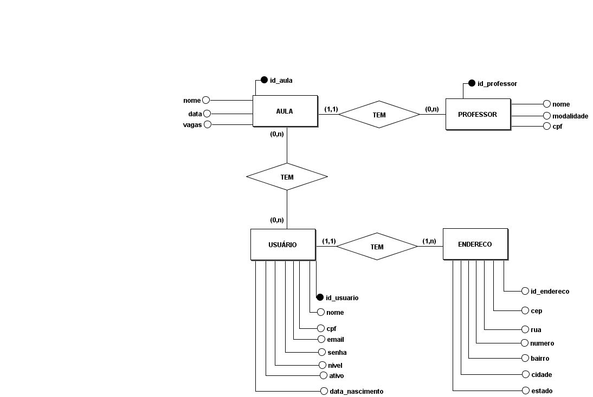
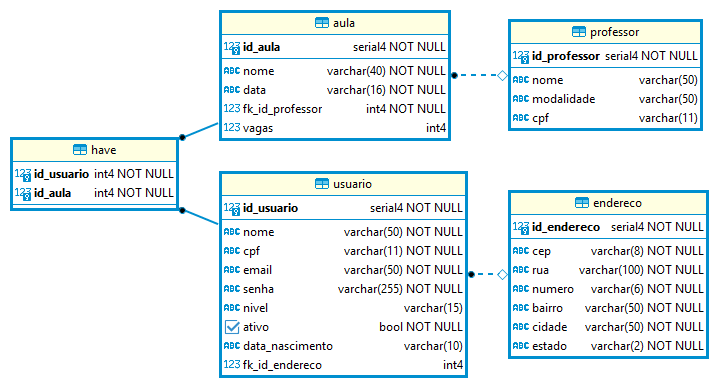

<h1>🧘Projeto - SaúdeA+ - Studio Pilates</h1>

> <h2> Sobre o Projeto</h2>

<p>
  O studio de Pilates (saúde a+) necessita sistema de gerenciamento das atividades/modalidades do estúdio e o agendamento de aulas teste e reposições. 
  Esse sistema poderá ser acessado pelos administradores do studio, pelos alunos matriculados ou visitantes que desejem agendar uma aula.
</p>

## Configurando e inicializando o projeto

Primeiramente deverá fazer o clone da aplicação em sua máquina:

Através do https
```
    git clone https://github.com/svvictorelias/pilates.git
```

Utilizamos o `npm install` para instalar todas as depedências utilizadas no projeto nas pastas *frontend* e *backend*.

```
    npm install 
```
Para essa próxima etapa é necessário ter o arquivo `.env` configurado

Logo após a instalação, utilizamos o `npx prisma generate` na pasta *backend* para inicilizar e gerar um cliente prisma. 
```
    npx prisma generate
```

Usamos o `npm run dev` na pasta *frontend* para iniciar o Front-End em modo de desenvolvimento utilizando a biblioteca `nodemon` no endereço: [http://localhost:3000](http://localhost:3000)
```
    npm run dev
```

Usamos o `npm run dev` na pasta *backend* para iniciar o Back-End em modo de desenvolvimento utilizando a biblioteca `nodemon` no endereço: [http://localhost:3001](http://localhost:3001)
```
    npm run dev
```

## Dependências

<ul>
    <li>
        <a href="https://www.prisma.io/docs/concepts/components/prisma-client">
            @prisma/client
        </a>
    </li>
    <li>
        <a href="https://www.npmjs.com/package/bcrypt">
            bcrypt
        </a>
    </li>
    <li>
        <a href="https://expressjs.com/pt-br/">
            express
        </a>
    </li>
    <li>
        <a href="https://www.npmjs.com/package/express-async-errors">
            express-async-errors
        </a>
    </li>
    <li>
        <a href="https://jwt.io/introduction">
            jsonwebtoken
        </a>
    </li>
    <li>
        <a href="https://www.npmjs.com/package/module-alias">
            module-alias
        </a>
    </li>
    <li>
        <a href="https://www.npmjs.com/package/uuid">
            uuid
        </a>
    </li>
</ul>

## Depedências de desenvolvimento
<ul>
    <li>
        <a href="https://www.npmjs.com/package/nodemon">
            nodemon
        </a>
    </li>
    <li>
        <a href="https://www.prisma.io/">
            prisma
        </a>
    </li>
</ul>

## Fluxo da Aplicação no Back-End


<h1> Regra de negócios </h1>


<hr/>
<table>
  <tr>
    <td align="center">
      <p>Entidades</p>
    </td>
    <td align="center">
      <p>Descrição</p>
    </td>
  </tr>
   <tr>
    <td align="center">
      <p>Usuário</p>
    </td>
    <td>
      <p>
        O Usuário poderá se cadastrar.
      </p>
      <p>
        O Usuário terá email, senha, cpf, endereço e telefone.
      </p>
      <p>
        O Usuário não poderá cadastrar caso o cpf ou email já estejam cadastrados.
      </p>
      <p>
        O Usuário poderá alterar email, senha, endereço, telefone, porém não o seu nível de acesso e cpf.
      </p>
      <p>
        O Usuário poderá excluir sua conta
      </p>
      <p>
        O Usuário terá um dashboard de aulas feitas e agendadas
      </p>
      <p>
        O Usuário poderá agendar a aula se houver vagas e se a data for superior ao dia corrente
      </p>
      <p>
        O Usuário verá o nome da aula, data, professor e modalidade
      </p>
      <p>
        O Usuário poderá cancelar a aula com até 1 hora de antecedência 
      </p>
    </td>
  </tr>
  <tr>
    <td align="center">
      <p>Administrador</p>
    </td>
    <td>
      <p>
        O Administrador do sistema pode cadastrar outros administradores e usuários.
      </p>
      <p>
        O Administrador poderá adicionar aulas e professores assim como apagar e editar.
      </p>
      <p>
        O Administrador poderá excluir aulas e professores.
      </p>
      <p>
        O Administrador poderá agendar aulas para usuários.
      </p>
      <p>
        O Administrador poderá alterar o nível de <strong>qualquer</strong> usuário.
      </p>
      <p>
        O Administrador poderá deletar <strong>qualquer</strong> usuário.
      </p>
    </td>
  </tr>
</table>

> <h3>Modelo de Dados - Conceitual </h3>

<hr/>

> <h3>Modelo de Dados - Lógico </h3>

<hr/>

> <h3> 👨‍💻 Desenvolvedor </h3>

  <a href="https://www.linkedin.com/in/svvictorelias/">
    
    <p>Victor <br/>Elias</p>
  </a>